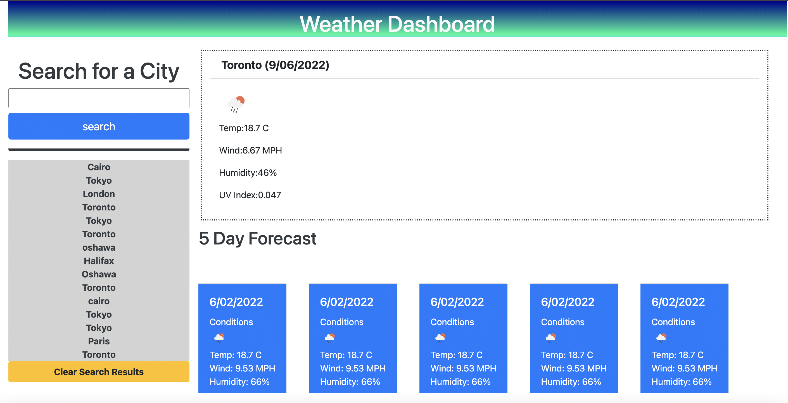

# Weather-Dashboard

### This app is used as a weather tracker. You can do a search for a city and it will return the current forecast and the 5 day projected forecast
### Forecase will include weather conditions, temperature, wind speeds, UV index and humidity. Your searches are saved to loacal storage so you can view one of the previous search results by clicking the city name in search history.

### badges

## Table of Contents

- [installation](#installation)
- [contribution guidelines](#contribution)
- [Test Instructions](#testing)
- [License](#license)
- [Questions](#questions)

### Installation
Live application is at this link :
 https://vinyldude8896.github.io/Weather-Dashboard/

### Contribution Guidelines
N/A as of yet
### Testing
Multiple days were spent testing to ensure proper data was being written to page from the API call data
### Questions
    email address : kevinnivek@me.com
    - additional instructions 
    I can be contacted by phone as well, but prefer email contact first.

### Images of example readme.md

